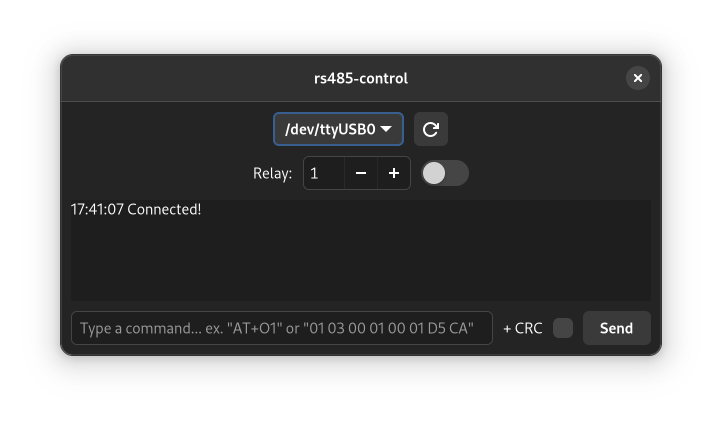

# rs485-control
Projekt oprogramowania do sterowania przekaźnikami za pomocą magistrali RS485 – ModBus RTU



## Budowanie dla Windowsa
1. Zainstaluj WSL2
2. Wejdź do środowiska WSL2 i wykonuj poniższe czynności
3. Zainstaluj Dockera/Podmana i git'a
4. Pobierz repozytorium i przejdź do niego
    ```shell
    git clone https://github.com/reticulis/rs485-control.git && cd rs485-control
    ```
5. Za pomocą poniższej komendy wejdź do środowiska "wykonawczego" (zostanie pobrane około 2GB danych):
   - Podman
    ```shell
    podman run -ti -v `pwd`:/mnt:Z mglolenstine/gtk4-cross:rust-gtk-4.6
    ```
   - Docker:
    ```shell
    docker run -ti -v `pwd`:/mnt mglolenstine/gtk4-cross:rust-gtk-4.6
    ```
6. Wykonaj komende `build`
7. Uruchom skrypt
   ```shell
   chmod +x package.sh && ./package.sh
   ```
8. Powstanie nowy katalog (rs485-control) oraz plik zip (rs485-control.zip), w obu znajdują się potrzebne pliki oraz plik wykonywalny .exe 

## Budowanie dla Linuxa (wspierana tylko Fedora)
1. Zainstaluj potrzebne biblioteki:
   ```shell
   sudo dnf install gtk4-devel libadwaita-devel rust-libudev-sys-devel
   ```
2. Zainstaluj Rust'a:
   - za pomocą dnf'a:
     ```shell
     sudo dnf install cargo
     ```
   - lub za pomocą [rustup](https://rustup.rs/ "Rustup")

3. Pobierz repozytorium i przejdź do niego
    ```shell
    git clone https://github.com/reticulis/rs485-control.git && cd rs485-control
    ```
4. Skompiluj program i uruchom
   ```shell
   cargo run --release
   ```
